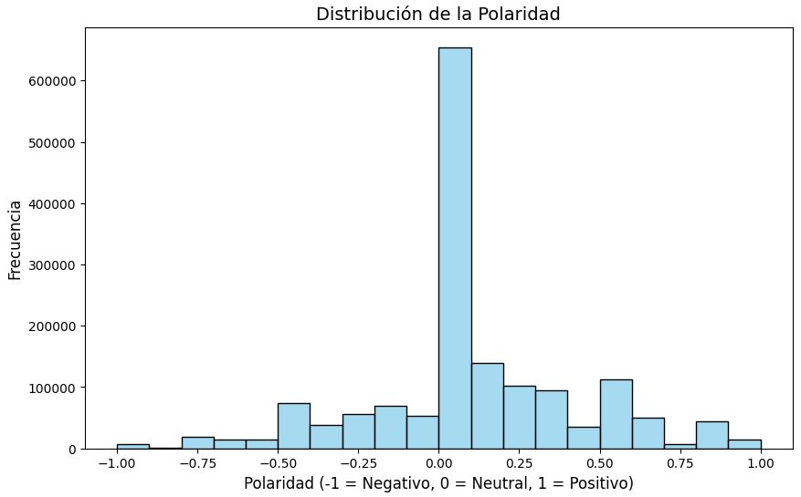
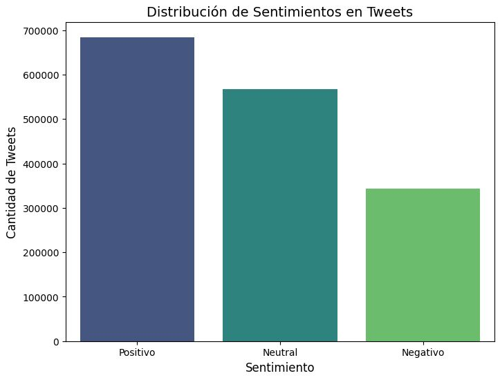

# 📊 Proyecto de Análisis de Sentimientos en Tweets

Este proyecto tiene como objetivo desarrollar un sistema de análisis de sentimientos para tweets, clasificándolos como positivos o negativos. Utilizando un conjunto de datos de 1.6 millones de tweets preprocesados, el proyecto implementa diversas técnicas de procesamiento de lenguaje natural (NLP) y aprendizaje automático para lograr una clasificación precisa.

## 🎯 Problema de Negocio

El análisis de sentimientos en redes sociales, particularmente en Twitter, tiene múltiples aplicaciones comerciales y de investigación:
- Monitoreo de la percepción de marca
- Análisis de la recepción de productos o servicios
- Detección de tendencias en la opinión pública
- Seguimiento de la satisfacción del cliente

Este proyecto busca crear un modelo robusto que pueda identificar automáticamente si un tweet expresa un sentimiento positivo o negativo.

## 📊 Contenido del Repositorio

- `TwitterSentiment_ML_Models.ipynb`: Notebook principal que contiene el código para la extracción de características y modelos de clasificación de sentimientos en tweets
- `Visualizaciones/`: Carpeta que contiene imágenes de visualización de datos
  - `distribucion_polaridad.JPG`: Visualización de la distribución de polaridad en los tweets
  - `distribucion_sentimientos.JPG`: Visualización de la distribución de sentimientos positivos, negativos y neutros
- Próximamente: Notebooks adicionales para análisis avanzados y experimentación

## 🔍 Enfoque Metodológico

### Preprocesamiento de Datos
- Limpieza de texto (eliminación de URLs, menciones, caracteres especiales)
- Normalización (conversión a minúsculas, manejo de emojis)
- Tokenización y eliminación de stopwords

### Extracción de Características
El proyecto implementa diversas técnicas para extraer características relevantes:
- Longitud del tweet
- Conteo de emojis
- Presencia de signos de exclamación e interrogación
- Características léxicas (palabras positivas/negativas)
- Vectorización de texto (Bag of Words, TF-IDF)
- Análisis de sentimiento basado en diccionarios (VADER, TextBlob)

### Modelado
El proyecto implementa tres modelos distintos para la clasificación de sentimientos:
- **XGBoost** (sin características enriquecidas): Algoritmo de boosting optimizado para rendimiento
- **LightGBM** (sin características enriquecidas): Framework de gradient boosting eficiente y rápido
- **LightGBM** (con características enriquecidas): Versión mejorada con características adicionales

Cada modelo fue entrenado y optimizado utilizando:
- Validación cruzada para evaluar el rendimiento
- Optimización de hiperparámetros para mejorar la precisión
- Técnicas de balanceo de clases para manejar posibles desbalances en los datos

## 📊 Visualizaciones

A continuación se muestran algunas visualizaciones clave del análisis:

### Distribución de Polaridad

*Distribución de los valores de polaridad en el conjunto de datos, mostrando la frecuencia de diferentes niveles de sentimiento.*

### Distribución de Sentimientos

*Comparación de la frecuencia de tweets positivos, negativos y neutrales en el conjunto de datos.*

Estas visualizaciones ayudan a entender la distribución de sentimientos en los datos y confirman el correcto funcionamiento de los modelos de clasificación implementados.

## 🛠️ Tecnologías Utilizadas

- **Python**: Lenguaje principal de programación
- **Pandas**: Manipulación y análisis de datos
- **NLTK**: Procesamiento de lenguaje natural
- **scikit-learn**: Algoritmos de aprendizaje automático
- **VADER**: Análisis de sentimientos basado en reglas
- **TextBlob**: Procesamiento de texto y análisis de sentimientos
- **Emoji**: Manejo y procesamiento de emojis

## 📈 Resultados

### Rendimiento de los Modelos

| Modelo | Accuracy | Negativo (P/R/F1) | Positivo (P/R/F1) |
|--------|----------|-------------------|-------------------|
| XGBoost sin enriquecidas | 0.7819 | 0.80/0.75/0.77 | 0.77/0.81/0.79 |
| LightGBM sin enriquecidas | 0.7813 | 0.80/0.75/0.77 | 0.76/0.82/0.79 |
| LightGBM con enriquecidas | 0.7838 | 0.80/0.76/0.78 | 0.77/0.81/0.79 |

#### Principales Hallazgos:

- **LightGBM con características enriquecidas** logra el mejor rendimiento global (78.38%)
- Las características enriquecidas mejoran el recall de tweets negativos sin sacrificar significativamente la precisión
- Los tres modelos son robustos y consistentes, con un rendimiento cercano al 78%
- La base de TF-IDF proporciona buenos resultados por sí sola, y las variables enriquecidas refinan los resultados

### Ejemplo de Predicción

```
Text Original: "Hello @leopoldo. Bootcam excelent!!!! Don't worry. All will be best always. No Change"
Text Limpio: "hello bootcam excelent dont worry all will be best always no change"

Resultados:
- XGBoost (sin características enriquecidas): Positivo
- LightGBM (sin características enriquecidas): Positivo
- LightGBM (con características enriquecidas): Positivo
```

Los tres modelos clasificaron correctamente este ejemplo como positivo, demostrando la robustez del sistema desarrollado.

## 🔜 Próximos Pasos

- Ampliar el conjunto de datos de entrenamiento con tweets más recientes
- Experimentar con arquitecturas avanzadas como BERT o GPT para comparar rendimiento
- Implementar una interfaz web para demostraciones interactivas
- Desarrollar una API para integraciones con otras aplicaciones
- Añadir soporte para análisis multilingüe
- Implementar análisis de sentimientos con mayor granularidad (más allá de binario positivo/negativo)

## 🔗 Referencias

- Dataset: Sentiment140 (1.6 millones de tweets etiquetados)
- Documentación de las bibliotecas utilizadas (NLTK, scikit-learn, etc.)
- Artículos académicos sobre análisis de sentimientos en redes sociales

---

⚠️ **Nota**: Este proyecto se encuentra en desarrollo y se actualizará regularmente con nuevos avances y resultados.
